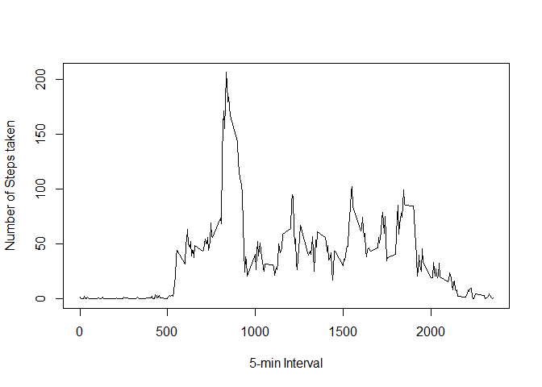
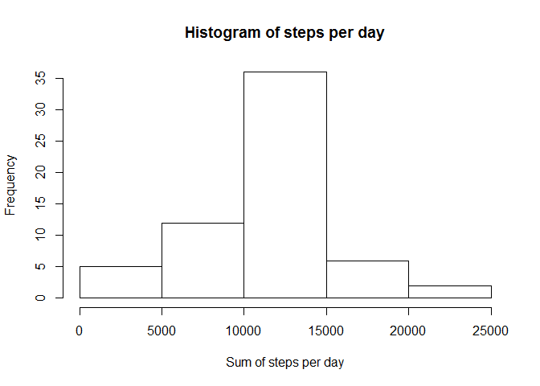

# Reproducible Research: Peer Assessment 1


## Loading and preprocessing the data


```r
activity <- read.csv("activity.csv")

#convert date format
activity$date <- as.Date(activity$date, format= "%Y-%m-%d")

#show header

head(activity)
```

```
##   steps       date interval
## 1    NA 2012-10-01        0
## 2    NA 2012-10-01        5
## 3    NA 2012-10-01       10
## 4    NA 2012-10-01       15
## 5    NA 2012-10-01       20
## 6    NA 2012-10-01       25
```

## What is mean total number of steps taken per day?

###1. Calculate the total number of steps taken per day

```r
steps<- aggregate(activity$steps, by=list(activity$date), sum, na.rm=T)
```

###2. Make a histogram of the total number of steps taken each day

```r
hist(steps$x, xlab = "Sum of steps per day", main = "Histogram of steps per day")
```

 

###3. Calculate and report the mean and median of the total number of steps taken per day


```r
mean_steps <- round(mean(steps$x))
print(c("The mean is",mean_steps))
```

```
## [1] "The mean is" "9354"
```


```r
median_steps <- round(median(steps$x))
print(c("The median is",median_steps))
```

```
## [1] "The median is" "10395"
```

## What is the average daily activity pattern?
###1. Make a time series plot (i.e. type = "l") of the 5-minute interval (x-axis) and the average number of steps taken, averaged across all days (y-axis)


```r
mean_steps_int <- tapply(activity$steps, activity$interval, mean, na.rm=T)
plot(mean_steps_int ~ unique(activity$interval), type="l", xlab = "5-min Interval", ylab = "Number of Steps taken")
```

 

###2. Which 5-minute interval, on average across all the days in the dataset, contains the maximum number of steps?


```r
max <- mean_steps_int[which.max(mean_steps_int)]

print(c("The max interval is",names(max)))
```

```
## [1] "The max interval is" "835"
```


## Imputing missing values

Note that there are a number of days/intervals where there are missing values (coded as NA). The presence of missing days may introduce bias into some calculations or summaries of the data.

###1. Calculate and report the total number of missing values in the dataset (i.e. the total number of rows with NAs)


```r
activity_na <- sum(is.na(activity$steps))

print(c("total number of rows with NAs is",activity_na))
```

```
## [1] "total number of rows with NAs is" "2304"
```

###2. Devise a strategy for filling in all of the missing values in the dataset. 

**My strategy**: For any NA is the step variable, the mean number of steps (variable = **mean_steps_int**) of the corresponding interval is taken as the replacing value. 


###3. Create a new dataset that is equal to the original dataset but with the missing data filled in.


```r
activity2 <- activity
for (i in 1:nrow(activity)){
    if(is.na(activity$steps[i])==T){
        activity2$steps[i]<- mean_steps_int[[as.character(activity[i, "interval"])]]
    }
}
```

The following code tests that  there are 0 NA values in **activity2**

```r
sum(is.na(activity2))
```

```
## [1] 0
```


###4. Make a histogram of the total number of steps taken each day and Calculate and report the mean and median total number of steps taken per day.  


```r
steps2<- aggregate(activity2$steps, by=list(activity2$date), sum, na.rm=T)
hist(steps2$x, xlab = "Sum of steps per day", main = "Histogram of steps per day")
```

 

Do these values differ from the estimates from the first part of the assignment?


```r
par(mfrow=c(1,2))
hist(steps$x, xlab = "Sum of steps per day (before inputing NA values)", main = "Histogram of steps per day")
hist(steps2$x, xlab = "Sum of steps per day (after inputing NA values)", main = "Histogram of steps per day")
```

 


What is the impact of imputing missing data on the estimates of the total daily number of steps?

```r
mean_steps2 <- round(mean(steps2$x))
median_steps2 <- round(median(steps2$x))
changes <- NULL
changes <- rbind(changes, data.frame(mean_steps_per_day = c(mean_steps, mean_steps2), median_steps_per_day = c(median_steps, median_steps2)))
rownames(changes) <- c("with NA's", "without NA's")
print(changes)
```

```
##              mean_steps_per_day median_steps_per_day
## with NA's                  9354                10395
## without NA's              10766                10766
```

## Are there differences in activity patterns between weekdays and weekends?
For this part the weekdays() function may be of some help here. Use the dataset with the filled-in missing values for this part.

###1. Create a new factor variable in the dataset with two levels - "weekday" and "weekend" indicating whether a given date is a weekday or weekend day.

```r
activity2$weekday_1 <- weekdays(activity2$date)
for (i in 1:nrow(activity2)){
    if(activity2$weekday_1[i] == "Sunday" | activity2$weekday_1[i] == "Saturday"){
        activity2$weekday[i]<- "weekend"
    } else {
            
    activity2$weekday[i]<- "weekday"
    }
}

activity2$weekday_1 <- NULL
```

###2. Make a panel plot containing a time series plot (i.e. type = "l") of the 5-minute interval (x-axis) and the average number of steps taken, averaged across all weekday days or weekend days (y-axis). 

Subset outo data for weekends and weekdays, and aggregate data based on mean steps taken for each interval

```r
activity2_weekend <- subset(activity2, activity2$weekday == "weekend")
activity2_weekday <- subset(activity2, activity2$weekday == "weekday")

mean_activity2_weekday <- tapply(activity2_weekday$steps, activity2_weekday$interval, mean)
mean_activity2_weekend <- tapply(activity2_weekend$steps, activity2_weekend$interval, mean)
```


Use lattice to plot graph

```r
library(lattice)
df_weekday <- NULL
df_weekend <- NULL
df_final <- NULL
df_weekday <- data.frame(interval = unique(activity2_weekday$interval), avg = as.numeric(mean_activity2_weekday), day = rep("weekday", length(mean_activity2_weekday)))
df_weekend <- data.frame(interval = unique(activity2_weekend$interval), avg = as.numeric(mean_activity2_weekend), day = rep("weekend", length(mean_activity2_weekend)))
df_final <- rbind(df_weekday, df_weekend)

xyplot(avg ~ interval | day, data = df_final, layout = c(1, 2), type = "l", ylab = "Number of Steps")
```

 
